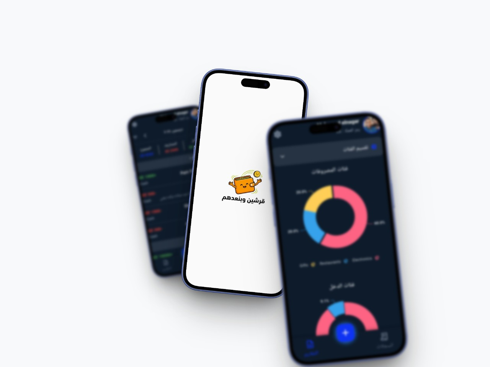

<div align="center">

# 💰 Expense Tracker

### قرشين وبنعدهم

A beautiful, feature-rich expense tracking application built with Flutter

[](https://flutter.dev)
[](https://dart.dev)
[](LICENSE)
[]()

<p align="center">
  
</p>


**Track your expenses and income with ease. Visualize your spending patterns and take control of your finances.**

[Features](#-features) • [Screenshots](#-screenshots) • [Installation](#-installation) • [Tech Stack](#-tech-stack) • [Architecture](#-architecture) • [Contributing](#-contributing)

</div>

---

## ✨ Features

### 📊 **Transaction Management**
- ➕ Add, edit, and delete income/expense transactions
- 📂 30+ predefined categories for expenses and 7+ for income
- 📝 Add notes and attachments to transactions
- 📅 Date-based filtering (Daily, Monthly, Yearly)
- 🔄 Swipe actions for quick transaction management

### 📈 **Reports & Analytics**
- 🥧 **Pie Charts** - Visualize expense distribution by category
- 📊 **Bar Charts** - Compare income vs expenses
- 📉 **Trend Line Charts** - Track spending trends over time
- 🍩 **Donut Charts** - Category-wise breakdown

### 🎨 **Customization**
- 🌙 **Dark/Light Theme** - Choose your preferred appearance
- 🔄 **System Theme** - Auto-switch based on device settings
- 🌍 **Multi-language Support** - English & Arabic (RTL supported)
- 💱 **Multiple Currencies** - Support for various currency symbols

### 🔒 **Security & Privacy**
- 🔐 **App Lock** - Secure your data with PIN protection
- 📱 **Local Storage** - All data stored securely on device
- 🛡️ **Privacy First** - No data sent to external servers

### 🔔 **Smart Reminders**
- ⏰ **Daily Reminders** - Never forget to track expenses
- 🔔 **Push Notifications** - Customizable reminder times
- 📅 **Background Scheduling** - Works even when app is closed

### 💾 **Data Management**
- 📤 **Backup** - Save your data securely to JSON file and share
- 📥 **Restore** - Recover your data from backup file
- 🗄️ **SQLite Database** - Fast and reliable local storage

---

## 📱 Screenshots

<div align="center">

| Home Screen | Add Transaction | Reports |
|:-----------:|:---------------:|:-------:|
| *Coming Soon* | *Coming Soon* | *Coming Soon* |

| Settings | Categories | Transaction Details |
|:--------:|:----------:|:-------------------:|
| *Coming Soon* | *Coming Soon* | *Coming Soon* |

</div>

---

## 🚀 Installation

### Prerequisites

- Flutter SDK `^3.9.2`
- Dart SDK `^3.0.0`
- Android Studio / VS Code
- Git

### Setup

1. **Clone the repository**
   ```bash
   git clone https://github.com/Mahmoudelnagar5/Expense-Tracker.git
   cd Expense-Tracker
   ```

2. **Install dependencies**
   ```bash
   flutter pub get
   ```

3. **Run the app**
   ```bash
   flutter run
   ```

### Build for Production

```bash
# Android APK
flutter build apk --release

# Android App Bundle
flutter build appbundle --release

# iOS
flutter build ios --release

# Web
flutter build web --release
```

---

## 🛠️ Tech Stack

<table>
<tr>
<td align="center" width="150">

**State Management**

</td>
<td align="center" width="150">

**Database**

</td>
<td align="center" width="150">

**Navigation**

</td>
<td align="center" width="150">

**Charts**

</td>
</tr>
<tr>
<td align="center">


</td>
<td align="center">


</td>
<td align="center">


</td>
<td align="center">


</td>
</tr>
</table>

### Key Dependencies

| Package | Purpose |
|---------|---------|
| `flutter_bloc` | State management with BLoC pattern |
| `sqflite` | Local SQLite database |
| `go_router` | Declarative routing |
| `fl_chart` | Beautiful charts |
| `syncfusion_flutter_charts` | Advanced chart widgets |
| `easy_localization` | Multi-language support |
| `flutter_local_notifications` | Push notifications |
| `workmanager` | Background tasks |
| `flutter_screen_lock` | App security with PIN |
| `flutter_screenutil` | Responsive UI |
| `image_picker` | Camera & gallery access |
| `permission_handler` | Runtime permissions |
| `path_provider` | File system access |
| `share_plus` | Share backup files |
| `file_picker` | Select backup files for restore |

---

## 🏗️ Architecture

The project follows **Clean Architecture** principles with **Feature-First** organization:

```
lib/
├── main.dart                 # App entry point
├── my_app.dart              # MaterialApp configuration
├── core/                     # Shared components
│   ├── helper/              # Utilities & constants
│   │   ├── constants/       # App-wide constants
│   │   ├── database/        # SQLite & SharedPrefs helpers
│   │   ├── enums/           # Enumerations
│   │   └── functions/       # Utility functions
│   ├── models/              # Data models
│   ├── routing/             # Navigation setup
│   ├── services/            # App services (notifications, etc.)
│   ├── theme/               # Theme configurations
│   ├── utils/               # Colors, styles, helpers
│   └── widgets/             # Reusable widgets
└── features/                 # Feature modules
    ├── onboarding/          # User onboarding flow
    │   ├── data/            # Data layer
    │   └── presentation/    # UI layer
    ├── records/             # Transaction management
    │   ├── controller/      # BLoC/Cubit
    │   └── presentation/    # Screens & widgets
    ├── reports/             # Analytics & charts
    │   └── presentation/    # Reports UI
    └── settings/            # App settings
        └── presentation/    # Settings UI
```

---

## 📂 Expense Categories

<details>
<summary><b>💸 Expense Categories (29)</b></summary>

| Category | Icon | Category | Icon |
|----------|------|----------|------|
| Entertainment | 🎭 | Phone | 📱 |
| Restaurants | 🍽️ | Shopping | 🛒 |
| Social | 👥 | Sports | 🏀 |
| Beauty | 💄 | Education | 🎓 |
| Groceries | 🧺 | Car | 🚗 |
| Clothing | 👔 | Transportation | 🚚 |
| Health | 🏥 | Travel | ✈️ |
| Electronics | 📟 | Bills | 🧾 |
| Home | 🏠 | Housing | 🏘️ |
| Repairs | 🔧 | Pets | 🐾 |
| Snacks | 🍔 | Gym | 🏋️ |
| Donations | 💧 | Gifts | 🎁 |
| Fuel | ⛽ | Fruits | 🍎 |
| Vegetable | 🥬 | Kids | 👶 |
| Other | 📦 | | |

</details>

<details>
<summary><b>💰 Income Categories (7)</b></summary>

| Category | Icon |
|----------|------|
| Bonus | ₿ |
| Investments | 💼 |
| Part-Time | 💵 |
| Salary | 💳 |
| Pocket Money | 👛 |
| Lottery | 🎰 |
| Other | 📦 |

</details>

---

## 🌍 Localization

The app supports multiple languages with RTL support:

| Language | Status | Code |
|----------|--------|------|
| 🇺🇸 English | ✅ Complete | `en` |
| 🇸🇦 Arabic | ✅ Complete | `ar` |

---

## 🤝 Contributing

Contributions are welcome! Please feel free to submit a Pull Request.

1. Fork the repository
2. Create your feature branch (`git checkout -b feature/AmazingFeature`)
3. Commit your changes (`git commit -m 'Add some AmazingFeature'`)
4. Push to the branch (`git push origin feature/AmazingFeature`)
5. Open a Pull Request

---

## 👨‍💻 Author

<div align="center">

**Mahmoud Elnagar**

[](https://github.com/Mahmoudelnagar5)

</div>

---

<div align="center">

### ⭐ Star this repo if you find it useful!

Made with ❤️ and Flutter

</div>
